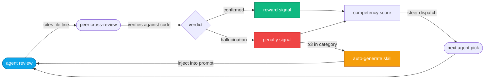

<p align="center">
  
</p>

<p align="center">
  <strong>Multi-agent consensus code review.</strong> 3+ AI agents review your code independently, cross-check each other's findings against your actual source, and only surface what survives — and the system learns which agent to trust for what.
</p>

<p align="center">
  <a href="https://www.npmjs.com/package/gossipcat"></a>
  <a href="https://www.npmjs.com/package/gossipcat"></a>
  <a href="https://github.com/gossipcat-ai/gossipcat-ai/blob/master/LICENSE"></a>
  <a href="#quickstart"></a>
  <a href="https://github.com/gossipcat-ai/gossipcat-ai/stargazers"></a>
  <a href="https://github.com/gossipcat-ai/gossipcat-ai/commits/master"></a>
  <a href="https://github.com/gossipcat-ai/gossipcat-ai/actions/workflows/ci.yml"></a>
  <a href="https://deepwiki.com/gossipcat-ai/gossipcat-ai"></a>
</p>

<p align="center">
  <a href="#quickstart"><strong>Install</strong></a> ·
  <a href="#first-run"><strong>First Run</strong></a> ·
  <a href="#daily-use"><strong>Daily Use</strong></a> ·
  <a href="#reading-the-dashboard"><strong>Dashboard</strong></a> ·
  <a href="#drive-it-from-your-browser"><strong>Chat Bridge</strong></a> ·
  <a href="#troubleshooting"><strong>Troubleshooting</strong></a> ·
  <a href="#configuration"><strong>Config</strong></a> ·
  <a href="#mcp-tools"><strong>Tools</strong></a>
</p>

<br/>

<p align="center">
  <a href="#reading-the-dashboard">
    
  </p>
  <p align="center">
    <em>Live dashboard at <code>http://localhost:&lt;port&gt;/dashboard</code> — fleet view, signal stream, skill-graduation grid, and consensus flow, all in real time.</em>
  </p>
</p>

<br/>

## Why

A single AI reviewer will, with total confidence, report bugs that aren't there. You read the finding, you go look, you waste twenty minutes — the code was fine. There's no second opinion and no track record, so you can't tell a real catch from a hallucination until you've already spent the time.

Gossipcat runs **several agents in parallel**, has them **cross-check each other's findings against your actual `file:line`**, and only surfaces what survives. When an agent invents a finding, a peer catches it and the agent's accuracy score drops — so over time the system routes each kind of work to whoever is actually reliable at it. Cross-review catches hallucinations a solo reviewer would have shipped to you; that delta is the whole point.

It runs as an MCP server inside **[Claude Code](https://claude.com/claude-code)** and **[Cursor](https://cursor.com)**, ships a [live operator dashboard](#reading-the-dashboard), and lets you [drive the orchestrator straight from the browser](#drive-it-from-your-browser).

**The consensus tags you'll see** (this is your whole job — read these, ignore the rest):

| Tag | Means | What you do |
|-----|-------|-------------|
| **CONFIRMED** | Multiple agents found it and verified it against the code | Fix it |
| **UNIQUE** | One agent found it, cross-checked and held up | Fix it — high signal |
| **DISPUTED** | Agents disagreed; gossipcat re-checked the code | Trust the verdict |
| **UNVERIFIED** | Looks real but wasn't cross-checked yet | Glance, then verify |

<br/>

## How it works



| Step | What happens |
|------|-------------|
| **Dispatch** | Tasks routed to agents by *dispatch weight* — each agent's measured accuracy in that category |
| **Parallel review** | Agents work independently, each producing findings with cited `file:line` |
| **Cross-review** | Each agent checks peers' findings against the real code: agree, disagree, unverified, or new |
| **Consensus** | Findings deduplicated and tagged CONFIRMED / DISPUTED / UNVERIFIED / UNIQUE |
| **Signals** | Verified findings (and caught hallucinations) become *reward signals* that update accuracy scores |
| **Skill development** | An agent that repeats a category of mistake gets a *skill file* — targeted instructions auto-generated from its own failure history — injected into future prompts |

The reward signal is **grounded in your source code, not a judge model's opinion.** Every finding cites a real `file:line`; peers verify the citation mechanically. That ground truth is what makes the loop trustworthy enough to automate. The "policy update" is a markdown file under `.gossip/agents/<id>/skills/` — no weights touched, no fine-tuning, no RLHF. (It's effectively in-context reinforcement learning at the prompt layer; the framing is deliberate, the mechanism is exactly the table above.)

> A small synthesis model (`consensus_judge`, configurable) merges and deduplicates the cross-review results — it does **not** grade quality. Verdicts come from citation checks against your code, never from one model judging another.

<br/>

## Native vs Relay agents

Every agent has a **type** (where it runs) and a **preset** (what skills it starts with — `reviewer`, `implementer`, `researcher`, …). You mix them freely; a team of native reviewers and relay researchers is perfectly normal.

| | Native | Relay |
|---|---|---|
| **Runs as** | A host subagent — Claude Code `Agent()` / Cursor `Task()` | A WebSocket worker on the relay server |
| **Providers** | Your Claude Code / Cursor subscription — **no API key** | Google (Gemini), OpenAI, xAI (Grok), DeepSeek, OpenClaw, Ollama, any OpenAI-compatible endpoint |
| **API key** | None | Required per provider |
| **Defined in** | `.claude/agents/<id>.md` | `.gossip/config.json` |
| **Consensus, memory, skills** | Yes | Yes |

Both participate equally in consensus and skill development. Relay workers get `file_read` + `file_grep` during cross-review so their verification parity matches natives.

<br/>

## How Gossipcat compares

| | What you get | Filters hallucinations | Improves over time |
|---|---|---|---|
| **Gossipcat** | 3+ agents cross-review each other's findings; confirmed bugs only | **Yes** — peers catch and penalize hallucinations mechanically | **Yes** — accuracy signals steer dispatch; skill files fix repeat failures |
| **Single-agent review** (Claude Code / Cursor built-in) | One model reviews your diff | No — hallucinations ship as findings | No feedback loop |
| **Model-grades-model review** | One model scores another's output | Partial — the judge can hallucinate too; no ground truth | Scores aren't wired to dispatch |
| **Pattern-match tools** (lint-style PR bots) | Rules + one LLM pass | No | No |

The difference: gossipcat verifies findings against actual `file:line` citations in *your* codebase. That ground truth is what makes the reward signal trustworthy enough to automate.

<br/>

<div align="center">
<table>
  <tr>
    <td align="center"><strong>Runs in</strong></td>
    <td align="center"><br/><sub>Full support</sub></td>
    <td align="center"><br/><sub>Full support</sub></td>
    <td align="center"><strong>Windsurf</strong><br/><sub>Planned</sub></td>
    <td align="center"><strong>VS Code</strong><br/><sub>Planned</sub></td>
  </tr>
</table>
<sub>Native agents run on Claude Code <code>Agent()</code> and Cursor <code>Task()</code>. Other MCP hosts work in relay-only mode (no native subagents).</sub>
</div>

<br/>

## Quickstart

**Requirements:** Node.js 22+ and either host below. Claude Code and Cursor are co-equal first-class hosts — pick the one you use; gossipcat auto-detects it and runs native agents either way.

**Fastest path (skills CLI):** one command installs the server and walks you through setup:

```bash
npx skills add gossipcat-ai/gossipcat-ai
```

This drops an installer skill into `.claude/skills/`; your agent runs the install and then hands off to `gossip_status()` for the live rules. Prefer it over the manual steps below if you use the [skills](https://github.com/vercel-labs/skills) CLI. The manual npm install is documented next.

Install the package once:
```bash
npm install -g gossipcat
```

<table>
<tr><th><a href="https://claude.com/claude-code">Claude Code</a></th><th><a href="https://cursor.com">Cursor</a></th></tr>
<tr valign="top">
<td>

Register the MCP server:
```bash
claude mcp add gossipcat -s user -- gossipcat
```
Restart Claude Code. Native agents dispatch via `Agent()`.

</td>
<td>

Add to `.cursor/mcp.json`:
```jsonc
{ "mcpServers": {
  "gossipcat": { "command": "gossipcat" }
} }
```
Reload Cursor. Native agents dispatch via `Task()`.

</td>
</tr>
</table>

Then in any project, ask the orchestrator: *"Set up a gossipcat team for this project."*

<details>
<summary><strong>Manual MCP config / alternative install paths</strong></summary>

Add to `~/.claude/mcp_settings.json` (Claude Code) or project-local `.mcp.json`:
```json
{ "mcpServers": { "gossipcat": { "command": "npx", "args": ["gossipcat"] } } }
```

```bash
# Pin to a version
npm install -g gossipcat@0.6.12

# Pin to a GitHub release tarball (bypasses the npm registry)
npm install -g https://github.com/gossipcat-ai/gossipcat-ai/releases/download/v0.6.12/gossipcat-0.6.12.tgz

# Project-local (postinstall writes .mcp.json — open the IDE there, no `mcp add` needed)
cd your-project && npm install --save-dev gossipcat

# From source (contributors)
git clone https://github.com/gossipcat-ai/gossipcat-ai.git && cd gossipcat-ai
npm install && npm run build:mcp
claude mcp add gossipcat -s user -- node "$PWD/dist-mcp/mcp-server.js"
```

The install ships the MCP server binary, the prebuilt dashboard (`dist-dashboard/`, launches on a dynamic port), bundled skill templates + rules + project archetypes, and a postinstall wizard that writes `.mcp.json` with correct absolute paths.

**Upgrade:** `npm install -g gossipcat@latest`, or ask in-session *"check for gossipcat updates"* (the `gossip_update` tool applies it with your confirmation).
</details>

### API keys (relay agents only)

Native agents need **no key**. For relay agents, pass provider keys with `-e` at registration or set them in your shell:

| Provider | How | Notes |
|----------|-----|-------|
| Native (Claude Code / Cursor) | — | Runs through your subscription. No key. |
| Anthropic API | `ANTHROPIC_API_KEY` | Direct API access without the subscription path |
| Google Gemini | `GOOGLE_API_KEY` | Built-in 429 watcher falls back to native on cooldown |
| OpenAI / compatible | `OPENAI_API_KEY` (+ `OPENAI_BASE_URL`) | Point `BASE_URL` at Azure / Together / Groq / OpenRouter |
| xAI (Grok) | OS keychain via `key_ref` | No env var — store in keychain, set `key_ref` (default service `grok`) |
| DeepSeek | OS keychain via `key_ref` | No env var — keychain, `key_ref` default service `deepseek` |
| OpenClaw 🦞 | — (local gateway) | OpenAI-compatible at `http://127.0.0.1:18789/v1`, auth via the local daemon |
| Ollama (local) | — | `http://localhost:11434`. `ollama pull llama3.1:8b` first |

Keys are stored persistently and cross-platform — macOS Keychain, Linux Secret Service (`secret-tool`), or an AES-256-GCM encrypted file on Windows. Mixing providers is the common production shape: cheap Gemini reviewers + native heavy implementers, dispatched by category strength.

<br/>

## First Run

The fastest path from "just installed" to "first useful review."

**1 · Open your IDE in a project and bootstrap once.** In Claude Code or Cursor, run:

> **Run gossip_status**

This loads gossipcat's operating rules into the session, creates `.gossip/` on first run, and prints the dashboard URL + auth key:

```
Status:
  Host: claude-code (native agents supported)   ← which IDE you're in
  Relay: running :49664                          ← background server for agents + dashboard
  Workers: 0                                     ← agents busy right now (rises during a round)
  Dashboard: http://localhost:49664/dashboard (key: c3208820…)  ← open it, paste the key
  Quota: google — OK                             ← provider rate-limit status (falls back to native on cooldown)
```

Open the dashboard URL, paste the key (it rotates each boot — re-run `gossip_status` for a fresh one).

**2 · Create your first team.** Tell the orchestrator what you're building:

> *"Set up a gossipcat team for this project — a TypeScript Next.js app with Postgres and Stripe."*

It proposes a team matched to your stack. **Smallest working team: `sonnet-reviewer` + `haiku-researcher` — both native, zero API keys.** Drop any relay agent whose provider key you don't have; add it later. Native agents (`native: true`) run on your subscription. Approve, and `.gossip/config.json` is written.

**3 · Run your first review** in a project with some changes:

> *"Do a consensus review of my recent changes"*

| Phase | Time | What you see |
|---|---|---|
| Decompose | ~1s | Orchestrator picks agents, dispatches in parallel |
| Independent review | 30s–2min | Each agent reads your diff and reports findings |
| Cross-review | 30s–1min | Each agent checks the others' findings against the code |
| Consensus report | <1s | Findings tagged CONFIRMED / DISPUTED / UNVERIFIED / UNIQUE |
| Verify + record | <1s | UNVERIFIED checked against code; accuracy signals saved |

```
Consensus round b81956b2-e0fa4ea4 — 3 agents

CONFIRMED (2):
  [critical] Race condition in tasks Map at server.ts:47 — sonnet + gemini
  [high]     Missing auth on WebSocket upgrade at server.ts:112 — sonnet + gemini
UNIQUE (1):
  [medium]   String concat in SQL query at queries.ts:88 — only sonnet caught this
DISPUTED (1):
  [low]      "Memory leak in timer" — haiku says yes, sonnet/gemini say no
             → verified: not a leak, cleanup is in finally. False alarm caught.

Final: 3 real bugs to fix, 1 false alarm caught by cross-review.
```

Act on **CONFIRMED** + verified **UNIQUE**. The false alarm that cross-review caught is the bug a single reviewer would have shipped to you.

<br/>

## <a id="daily-use"></a>How to use it day-to-day

Each recipe: what to type, what you get, what to do with it.

**Review a diff before committing** → *"Review my staged changes."* Consensus report in 1–3 min; fix CONFIRMED + verified findings. For diffs under ~20 lines, skip consensus — ask `gossip_run` for a single fast agent (~10s) and save the round.

**Catch security issues** → *"Security audit `lib/stripe/webhook.ts`."* Each security agent reviews from a different angle (OWASP, validation, auth, secrets); real vulns survive cross-review, theoretical ones get dropped. Be specific about the file — "audit the codebase" is too broad.

**Understand code before changing it** → *"Research how the WebSocket lifecycle works before I touch it."* A research agent traces call paths and writes a summary into its cognitive memory, so next time it remembers — no re-discovery cost.

**Verify your own assumption** → *"I think there's a race in the tasks Map at server.ts:47 — check if I'm right."* Two agents independently confirm or push back. Author self-review is optimistic; this isn't.

**See which agents you can trust** → *"Show me agent scores."* Per-category accuracy + dispatch weights. If `gemini-reviewer` sits at 30% on `concurrency`, don't trust its concurrency findings solo.

**Improve a struggling agent** → *"gemini-reviewer keeps hallucinating about concurrency — develop a skill for it."* Gossipcat generates a targeted skill from its failure data and measures whether it works (z-test on post-bind signals). Then it's automatic.

> **Avoid:** "review the whole codebase" (too broad — scope to a file/module/diff); approving findings without reading the reasoning; running consensus for trivial questions (use a single `gossip_run` agent).

<br/>

## Reading the dashboard

Open it once with the key from `gossip_status`; leave the tab open while you work. Every tool call pushes a live WebSocket update.

<p align="center">
  
</p>
<p align="center"><em>Skill-graduation grid — each card is one (skill × agent): post-bind effectiveness over a 7-day window vs threshold, with ±pp drift on graduated skills.</em></p>

| Panel | What it shows |
|---|---|
| **Overview** | Active agents, dispatch weights, recent finding counts |
| **Team** | Agents sorted by reliability, with category breakdowns |
| **Tasks** | Live + historical tasks with agent, duration, status |
| **Findings** | Consensus reports by round, CONFIRMED/DISPUTED/UNVERIFIED breakdowns |
| **Agent detail** | Per-agent memory, skills, score history, task history |
| **Signals** | Raw signal feed (agreement / hallucination / unique_confirmed) |
| **Chat** | Live two-way bridge into the orchestrator (see below) |
| **Logs** | `mcp.log` (boot, errors, warnings) |

<br/>

## <a id="drive-it-from-your-browser"></a>Drive it from your browser

The dashboard's **Chat** page is a live, two-way bridge into the running orchestrator — type from the browser and your message lands in the active session; the orchestrator's dispatches, findings, and replies mirror back into the same thread in real time.

| Capability | What it does |
|---|---|
| **Multi-conversation tabs** | Several independent threads side by side — each its own `chat_id`, history, and live stream; per-tab unread, persisted across reloads |
| **Renamable tabs** | Double-click or **F2** to label a tab ("auth refactor", "perf audit") — survives reload |
| **Working-agents rail** | Live rail of who's dispatched and working right now — watch a round progress without leaving chat |
| **Structured questions** | When the orchestrator needs a decision, `gossip_ask` renders a single/multi-select card right in the chat; your pick flows back as a normal turn |

The `gossip_ask` answer boundary is fail-closed: only known options are accepted and "Other" free-text is sanitized before it reaches the orchestrator, so a dashboard answer can't smuggle instructions into the session. Launch with the `gossipcat code` wrapper (or ask the orchestrator to enable channel mode), then open the **Chat** tab.

<br/>

## Host compatibility

Gossipcat auto-detects the host and adapts dispatch + the rules file it writes.

| Host | Native agents | Rules file |
|------|---------------|------------|
| **Claude Code** | Yes — `Agent()` | `.claude/rules/gossipcat.md` |
| **Cursor** | Yes — `Task(subagent_type, model, …)` | `.cursor/rules/gossipcat.mdc` |
| Windsurf | Relay-only (planned) | `.windsurfrules` |
| VS Code | Relay-only (planned) | — |

On Claude Code and Cursor, native agents run with no API key and participate fully in consensus. Other MCP hosts can still run relay agents.

<br/>

## Troubleshooting

**Dashboard says unauthorized / 401** — the key rotates every boot. Run `gossip_status` for the current key.

**Dashboard URL won't load** — check `.gossip/mcp.log` for the `🌐 Dashboard:` line (the real port). If missing, the relay didn't start: delete a stale `.gossip/relay.pid` from a crashed boot and restart, or free up `GOSSIPCAT_PORT` if it's taken.

**Agents return empty findings** — usually quota. `gossip_status` shows `Quota: <provider> — OK / cooling down`. On a rate limit gossipcat falls back to native agents (add some to your team if you have none).

**The same hallucinated finding keeps coming back** — record it: *"record a hallucination_caught signal for finding f3 — it claimed X but the code shows Y."* After 3, the agent's score drops in that category and dispatch stops routing it there.

**An agent produced output but the consensus report is empty** — the strict `<agent_finding>` parser drops tags whose `type` isn't `finding | suggestion | insight` (invariant #8 in `docs/HANDBOOK.md`); the `gossip_signals` receipt surfaces the drop and a `finding_dropped_format` signal. If you see `&lt;agent_finding&gt;` instead of raw tags, a transport layer is entity-encoding output — pass agent output verbatim to `gossip_relay`.

**Multiple IDE instances** — each gets its own dynamic port. For a stable port on one project, set `GOSSIPCAT_PORT=24420` in that environment.

**Uninstall** — `npm uninstall -g gossipcat && claude mcp remove gossipcat -s user`; `rm -rf ~/.gossip` (global state) or `<project>/.gossip` (per-project).

**Still stuck?** [Open an issue](https://github.com/gossipcat-ai/gossipcat-ai/issues) with the last 100 lines of `.gossip/mcp.log` + `gossip_status` output, or ask in-session *"file a gossipcat bug report about …"* (`gossip_bug_feedback` packages it).

<br/>

## Configuration

Most of `.gossip/config.json` is **auto-generated by `gossip_setup()`** — hand-edit only to change providers/models/endpoints. First-run defaults work for most projects. Config is searched: `.gossip/config.json` → `gossip.agents.json` → `gossip.agents.yaml`.

```json
{
  "main_agent":      { "provider": "google",    "model": "gemini-2.5-pro" },
  "utility_model":   { "provider": "native",    "model": "haiku" },
  "consensus_judge": { "provider": "anthropic", "model": "claude-sonnet-4-6", "native": true },
  "agents": {
    "sonnet-reviewer": {
      "provider": "anthropic", "model": "claude-sonnet-4-6",
      "preset": "reviewer", "skills": ["code_review", "security_audit", "typescript"],
      "native": true
    }
  }
}
```

| Field | Description |
|-------|-------------|
| `main_agent` | Internal LLM for routing, planning, synthesis (set `provider: "none"` on Claude Code / Cursor to let the host classify natively) |
| `utility_model` | Memory compaction, gossip, lens generation |
| `consensus_judge` | Synthesis-only model that merges cross-review results (does not grade) |
| `agents.<id>.provider` | `anthropic`, `google`, `openai`, `grok`, `deepseek`, `openclaw`, `local`, `native` |
| `agents.<id>.key_ref` | Keychain service to read the provider key from (default = provider name). Used by keychain providers (`grok`, `deepseek`); env-var providers (`openai`, `google`, `anthropic`) read their key from the environment instead |
| `agents.<id>.base_url` | Custom endpoint for `openai` / `openclaw` (e.g. `http://127.0.0.1:18789/v1`) |
| `agents.<id>.native` | `true` = runs via the host's native tool, no API key |
| `agents.<id>.preset` | `reviewer`, `implementer`, `tester`, `researcher`, `debugger`, `architect`, `security`, `designer`, `planner`, `devops`, `documenter` |
| `agents.<id>.skills` | Skill labels for dispatch matching |

<details>
<summary><strong>OpenClaw 🦞 (local gateway provider)</strong></summary>

[OpenClaw](https://github.com/openclaw/openclaw) runs locally and exposes an OpenAI-compatible API; gossipcat talks to it like any relay agent, with a separate quota slot so its rate limits don't bleed into your OpenAI agents. Store the gateway token once (macOS: `security add-generic-password -s gossip-mesh -a openclaw -w <token>`; Linux: `secret-tool store --label "Gossip Mesh openclaw" service gossip-mesh provider openclaw`), then add an agent with `provider: "openclaw"` (default `base_url` `http://127.0.0.1:18789/v1`, models `openclaw` / `openclaw/default` / `openclaw/main`). It joins consensus and earns skills like any other agent.
</details>

<br/>

## MCP Tools

The orchestrator (Claude Code / Cursor) selects and calls these from your natural-language requests — you don't invoke them manually.

| Tool | Purpose |
|------|---------|
| `gossip_status` | System status, dashboard URL, agent list |
| `gossip_setup` | Create or update an agent team |
| `gossip_run` | Single-agent dispatch with auto agent selection |
| `gossip_dispatch` | Multi-agent dispatch: `single`, `parallel`, or `consensus` |
| `gossip_collect` | Collect results with optional cross-review synthesis |
| `gossip_plan` | Decompose a task into sub-tasks with agent assignments |
| `gossip_signals` | Record or retract accuracy signals |
| `gossip_scores` | View agent accuracy, uniqueness, dispatch weights |
| `gossip_skills` | Develop, bind, unbind, or list per-agent skills |
| `gossip_resolve_findings` | Mark consensus findings resolved/open |
| `gossip_remember` | Search an agent's cognitive memory |
| `gossip_verify_memory` | Check a memory claim against current code (FRESH / STALE / CONTRADICTED) before acting on backlog |
| `gossip_session_save` | Save session context for the next session |
| `gossip_progress` | Check in-progress task status |
| `gossip_watch` | Stream signals as agents emit them (catches pipeline drops mid-round) |
| `gossip_ask` | Ask the dashboard a structured single/multi-select question |
| `gossip_guide` | Print the gossipcat handbook for humans |
| `gossip_config` | Manage runtime feature-gate flags |
| `gossip_format` | Return the canonical `<agent_finding>` output format block |
| `gossip_tools` | List all available tools |
| `gossip_update` | Check for / apply gossipcat updates from npm |
| `gossip_bug_feedback` | File a GitHub issue from an in-session bug report |
| `gossip_reload` | Self-terminate so the host respawns with a fresh bundle (dev loop) |
| _orchestrator-only_ | `gossip_relay`, `gossip_relay_cross_review`, `reply` — used internally to feed native results + the chat bridge back into the pipeline; you never call these |

<br/>

## Architecture

```
gossipcat/
  apps/cli/               MCP server, host-aware native agent bridge, boot sequence
  packages/
    orchestrator/         Dispatch pipeline, consensus engine, memory, skills,
                          performance scoring, task graph, prompt assembly
    relay/                WebSocket relay server, dashboard REST/WS API
    dashboard-v2/         React + Vite + shadcn/ui frontend (warm-cream theme — see DESIGN.md)
    client/               Lightweight WebSocket client for relay connections
    tools/                File / shell / git tool implementations for worker agents
    types/                Shared TypeScript types and message protocol
```

The dashboard ships prebuilt in `dist-dashboard/` and the relay serves it as static files; rebuild from source with `npm run build:dashboard`.

> **Reading this as a Claude Code or Cursor instance?** Call `gossip_status()` — it boots your full operating rules. The detailed orchestrator workflow (dispatch rules, consensus protocol, signal pipeline) lives in [`CLAUDE.md`](CLAUDE.md) and [`.claude/rules/gossipcat.md`](.claude/rules/gossipcat.md).

<br/>

## Roadmap

Shipped work lives in [CHANGELOG.md](CHANGELOG.md) and [GitHub Releases](https://github.com/gossipcat-ai/gossipcat-ai/releases). What's next:

| Feature | Status |
|---------|--------|
| Dashboard enrichment (graphs, trends, session history) | ☐ Planned |
| Local Postgres migration (tasks/signals/consensus/memory — full task results, real queries, no JSONL scans) | ☐ Planned |
| Windsurf / VS Code native parity | ☐ Planned |
| Standalone CLI (no IDE required) + chat-mode pipeline parity | ☐ Planned |

<br/>

## Contributing

Gossipcat is open source and early-stage — bug reports, ideas, and PRs welcome.

- **Bugs / features** → [open an issue](https://github.com/gossipcat-ai/gossipcat-ai/issues), or ask Claude Code *"file a gossipcat bug report about …"* (`gossip_bug_feedback` posts a structured issue).
- **Pull requests** → fork, branch, PR against `master`. Run `npm test` first. Conventional commits (`fix:`, `feat:`, `chore:`, `docs:`). Release process and contributor setup are in [CONTRIBUTING.md](CONTRIBUTING.md).
- **Discussions** → [GitHub Discussions](https://github.com/gossipcat-ai/gossipcat-ai/discussions).

[`CLAUDE.md`](CLAUDE.md) documents the operational rules gossipcat's own agents follow during development — a useful read for understanding the signal pipeline and consensus workflow from the inside.

<br/>

## Star History

<a href="https://www.star-history.com/?repos=gossipcat-ai%2Fgossipcat-ai&type=date&legend=bottom-right">
 <picture>
   <source media="(prefers-color-scheme: dark)" srcset="https://api.star-history.com/chart?repos=gossipcat-ai/gossipcat-ai&type=date&theme=dark&legend=top-left" />
   <source media="(prefers-color-scheme: light)" srcset="https://api.star-history.com/chart?repos=gossipcat-ai/gossipcat-ai&type=date&legend=top-left" />
   
 </picture>
</a>

## License

[MIT](LICENSE)

**Image attachments (vision-capable relay agents):**

Relay agents on vision-capable providers (OpenAI, Google Gemini, Anthropic, Grok, local Ollama)
can receive images. Pass an `images` array of **local absolute PNG/JPEG paths** — the relay
worker reads each file, base64-encodes it, and attaches it as a native image content part
(OpenAI `image_url` data URI, Gemini `inlineData`, Anthropic `image` block):

```
gossip_dispatch(
  mode: "single",
  agent_id: "gpt56-critic",
  task: "Critique the HUD layout in this screenshot",
  images: ["/abs/path/Logs/hud.png"]
)

// Per-task in parallel / consensus:
gossip_dispatch(mode: "consensus", tasks: [
  { agent_id: "gpt56-critic",    task: "...", images: ["/abs/path/a.png"] },
  { agent_id: "gemini31-critic", task: "...", images: ["/abs/path/a.png"] }
])
```

Auto-detect: if you omit `images`, any absolute PNG/JPEG paths already present in the task
text are auto-attached (up to 4) — existing text workflows that cite screenshot paths start
sending pixels with no change.

Limits & behavior:
- **Max 4 images** per task; overflow is rejected with a clear error (not silently truncated).
- **≤ 4 MB each**; larger files are rejected per-image. Reads are capped and go through a
  single file descriptor (open → fstat → read the *same* fd), so a file swapped or grown
  between the size check and the read cannot smuggle a larger/different file (TOCTOU-resistant).
- **PNG / JPEG only** — validated by extension **and** magic-byte sniff (a renamed non-image is rejected).
- **Path policy (allowed-root confinement).** Every image path is `realpath`'d (symlinks
  followed) and must resolve **within the dispatching project root**. A path that escapes the
  root — via `..`, an absolute path elsewhere, or a symlink pointing outside — is rejected with
  a per-image "path policy" error and is never opened. Image paths are untrusted input (they
  come from the caller or from task prose), so they are confined the same way citation
  resolution roots are (`realpath` both sides + prefix check).
- A **non-existent / unreadable path** produces a clear per-image error surfaced in the task
  context, never a silent drop.
- **Explicit vs auto-detect error surfacing.** Errors from an **explicit `images` field** are
  appended to the agent's prompt (the caller asked for those attachments). Errors from
  **auto-detected** prose paths are **log-only** — a path-shaped token in prose that fails to
  resolve must not mutate the prompt, keeping pure-prose tasks byte-identical to pre-feature
  behavior.
- **Text-only providers** (e.g. DeepSeek) ignore the field with a logged notice.
- **The native (Agent-tool) path does NOT deliver images.** gossipcat has no native multimodal
  wiring; native subagents run through the host `Agent()` tool, which the dispatch handler
  cannot feed pixels. Passing `images` to a native agent produces an explicit
  *"images are relay-only; native agent X did not receive N image(s)"* notice in the dispatch
  response rather than a silent drop.

