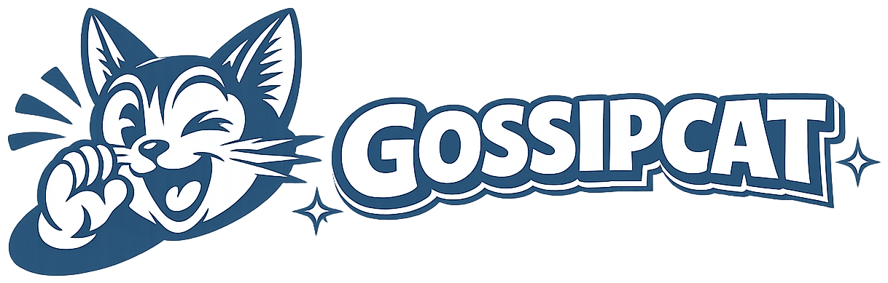

<p align="center">
  
</p>

<p align="center">
  <em>agentic orchestration framework — agents that learn, adapt, and get better every round.</em>
</p>

<p align="center">
  <a href="https://github.com/ataberk-xyz/gossipcat-ai"></a>
  <a href="https://github.com/ataberk-xyz/gossipcat-ai/blob/master/LICENSE"></a>
  <a href="#quickstart"></a>
</p>

<p align="center">
  <a href="#quickstart"><strong>Quickstart</strong></a> ·
  <a href="#how-it-works"><strong>How It Works</strong></a> ·
  <a href="#usage"><strong>Usage</strong></a> ·
  <a href="#dashboard"><strong>Dashboard</strong></a> ·
  <a href="#configuration"><strong>Configuration</strong></a> ·
  <a href="#roadmap"><strong>Roadmap</strong></a>
</p>

<br/>

## What is Gossipcat?

Gossipcat is an MCP server that orchestrates multiple AI agents to review your code in parallel. Agents independently review, then cross-review each other's findings. Agreements are confirmed. Hallucinations are caught and penalized. Over time, each agent builds an accuracy profile — the system learns who to trust for what.

<br/>

## Why multi-agent?

| Without gossipcat | With gossipcat |
|---|---|
| One AI reviews your code — and hallucinates a finding you waste 20 minutes on | Multiple agents cross-check each other — hallucinations get caught before you see them |
| Every agent gets the same tasks regardless of track record | Dispatch weights route tasks to the agent with the best accuracy in that category |
| An agent keeps making the same class of mistake | Skill files are auto-generated from failure data and injected into future prompts |
| You don't know which agent to trust | Accuracy, uniqueness, and reliability scores are tracked per agent, per category |

<br/>

## Gossipcat is right for you if

- You want **multiple AI models** catching different classes of bugs
- You don't trust a single agent to catch everything
- You want agents to **cross-check each other's findings** before you act on them
- You want to know which agents are **actually accurate** vs. hallucinating
- You want agents that **get better over time** based on their track record

<br/>

## Features

<table>
<tr>
<td align="center" width="33%">
<h3>Consensus Review</h3>
3+ agents review independently, then cross-review each other. Findings tagged as CONFIRMED, DISPUTED, or UNIQUE.
</td>
<td align="center" width="33%">
<h3>Adaptive Dispatch</h3>
Agent accuracy is tracked per-category. Dispatch weights adjust automatically — the best agent for the job gets picked.
</td>
<td align="center" width="33%">
<h3>Skill Development</h3>
When an agent keeps failing in a category, targeted skills are generated from failure data and injected into future prompts.
</td>
</tr>
<tr>
<td align="center">
<h3>Multi-Provider</h3>
Mix Anthropic, Google, and OpenAI agents in one team. Each brings different strengths. Native agents need no API key.
</td>
<td align="center">
<h3>Live Dashboard</h3>
Real-time view of tasks, consensus reports, agent scores, and activity feed. Terminal Amber theme. WebSocket updates.
</td>
<td align="center">
<h3>Agent Memory</h3>
Per-agent cognitive memory persists across sessions. Agents remember past findings, patterns, and project context.
</td>
</tr>
</table>

<br/>

<div align="center">
<table>
  <tr>
    <td align="center"><strong>Works<br/>with</strong></td>
    <td align="center"><strong>Claude Code</strong><br/><sub>Full support</sub></td>
    <td align="center"><strong>Cursor</strong><br/><sub>Relay agents</sub></td>
    <td align="center"><strong>Windsurf</strong><br/><sub>Relay agents</sub></td>
    <td align="center"><strong>VS Code</strong><br/><sub>Relay agents</sub></td>
  </tr>
</table>
</div>

<br/>

## How it works

```
  dispatch ──→ parallel review ──→ cross-review ──→ consensus
                                                       │
                                                 ┌─────┴─────┐
                                                 ▼           ▼
                                             signals    skill development
                                                 │           │
                                                 ▼           ▼
                                          dispatch weights   targeted prompts
                                          (who gets picked)  (agent improves)
```

| Step | What happens |
|------|-------------|
| **Dispatch** | Tasks routed to agents based on dispatch weights (accuracy history per category) |
| **Parallel review** | Agents work independently, each producing findings with confidence scores |
| **Cross-review** | Each agent reviews peers' findings: agree, disagree, unverified, or new finding |
| **Consensus** | Findings deduplicated and tagged: CONFIRMED, DISPUTED, UNVERIFIED, UNIQUE |
| **Signals** | You verify findings against code and record accuracy signals |
| **Skill development** | Agents with repeated failures get targeted skill files injected into future prompts |

<br/>

## Two types of agents

| | Native | Relay |
|---|---|---|
| **Runs as** | Claude Code subagent (`Agent()` tool) | WebSocket worker on relay server |
| **Providers** | Anthropic (Claude) | Google (Gemini), OpenAI, any provider |
| **API key** | None — uses your Claude Code subscription | Required per provider |
| **Defined in** | `.claude/agents/*.md` | `.gossip/config.json` |
| **Consensus** | Yes | Yes |
| **Memory & Skills** | Yes | Yes |

Both types participate equally in consensus, cross-review, and skill development.

<br/>

## Quickstart

**Requirements:** Node.js 22+

### 1. Clone and build

```bash
git clone https://github.com/ataberk-xyz/gossipcat-ai.git
cd gossipcat-ai
npm install
npm run build:mcp
```

`npm install` generates `.mcp.json` with the correct paths for your machine. `build:mcp` bundles the MCP server. Open Claude Code in this directory and gossipcat connects automatically.

To register globally (available in all projects):
```bash
claude mcp add gossipcat -s user -- node /absolute/path/to/gossipcat-ai/dist-mcp/mcp-server.js
```

### 3. API keys

Add env vars for the providers you want to use. Pass them with `-e` when registering, or set them in your shell environment.

| Provider | Env var | Notes |
|----------|---------|-------|
| Google Gemini | `GOOGLE_API_KEY` | For Gemini relay agents |
| OpenAI | `OPENAI_API_KEY` | For OpenAI relay agents |
| Anthropic | — | Native agents use your Claude Code subscription — no key needed |

Example with Gemini:
```bash
claude mcp add gossipcat -s user -e GOOGLE_API_KEY=your-key -- node /path/to/gossipcat/dist-mcp/mcp-server.js
```

Keys are stored persistently and cross-platform:
- **macOS** — OS Keychain
- **Linux** — Secret Service (`secret-tool`)
- **Windows / other** — AES-256-GCM encrypted file

### 4. Initialize your team

Start a Claude Code session in any project and ask Claude to set up your team:

```
"Set up a gossipcat team with a Gemini reviewer and a Sonnet implementer"
```

Claude Code calls `gossip_setup()` to create your `.gossip/config.json` and agent definitions. You choose the providers, models, and roles — gossipcat adapts to your setup.

Available presets: `reviewer`, `implementer`, `tester`, `researcher`, `debugger`, `architect`, `security`, `designer`, `planner`, `devops`, `documenter`

<br/>

## Usage

Once gossipcat is installed, you interact with it through natural language in Claude Code. The CLAUDE.md rules file (auto-generated on first boot) teaches Claude Code how to use the gossipcat tools — you just describe what you want.

### What to say to Claude Code

| What you want | What to type |
|---------------|-------------|
| Review your latest changes | *"Review my recent changes"* |
| Deep review of critical code | *"Do a consensus review on the auth module"* |
| Check which agents are performing well | *"Show me agent scores"* |
| Research before building | *"Research how the dispatch pipeline works"* |
| Plan a feature | *"Plan the implementation for user notifications"* |
| Save context for next session | *"Save session"* |

Claude Code reads the dispatch rules from `.claude/rules/gossipcat.md` and automatically decides whether to use single-agent, parallel, or consensus mode based on what your change touches.

### Example session

```
You:    "Review the changes I made to the relay server with the gossipcat team"

Claude: Dispatches 3 agents via gossip_dispatch(mode: "consensus")
        → sonnet-reviewer checks for security issues
        → gemini-reviewer checks for logic bugs
        → gemini-tester checks for edge cases

        Cross-review round: agents review each other's findings

        Consensus report:
        ✓ CONFIRMED: race condition in connection cleanup (3/3 agree)
        ✓ CONFIRMED: missing error handler on WebSocket close (2/3 agree)
        ? UNVERIFIED: potential memory leak in Map (1 found, others couldn't verify)

        Claude verifies the UNVERIFIED finding against your code,
        records accuracy signals, and presents the final report.
```

### Under the hood

Claude Code translates your requests into gossipcat MCP tool calls:

```
gossip_run(agent_id: "auto", task: "...")        → single-agent task
gossip_dispatch(mode: "consensus", tasks: [...]) → multi-agent review
gossip_collect(consensus: true)                  → cross-review + report
gossip_signals(action: "record", signals: [...]) → record accuracy
gossip_scores()                                  → view agent performance
gossip_skills(action: "develop", ...)            → improve struggling agents
```

You don't need to type these — Claude Code handles tool selection. But you can call them directly if you want fine-grained control.

<br/>

## MCP Tools

| Tool | Purpose |
|------|---------|
| `gossip_status` | System status, dashboard URL, agent list |
| `gossip_run` | Single-agent dispatch with auto agent selection |
| `gossip_dispatch` | Multi-agent dispatch: `single`, `parallel`, or `consensus` |
| `gossip_collect` | Collect results with optional cross-review synthesis |
| `gossip_relay` | Feed native agent results back into the pipeline |
| `gossip_relay_cross_review` | Feed native cross-review results into consensus |
| `gossip_plan` | Decompose task into sub-tasks with agent assignments |
| `gossip_signals` | Record or retract accuracy signals |
| `gossip_scores` | View agent accuracy, uniqueness, and dispatch weights |
| `gossip_skills` | Develop, bind, unbind, or list per-agent skills |
| `gossip_setup` | Create or update agent team |
| `gossip_session_save` | Save session context for next session |
| `gossip_remember` | Search an agent's cognitive memory |
| `gossip_progress` | Check in-progress task status |
| `gossip_tools` | List all available tools |

<br/>

## Dashboard

Launches automatically on port `24420`. Access the URL from `gossip_status`.

Built with React + Vite + shadcn/ui (Terminal Amber theme):

- **Overview** — agent cards with dispatch weights, recent tasks, finding metrics
- **Team** — all agents sorted by reliability
- **Tasks** — task history with agent, duration, and status
- **Findings** — consensus reports with CONFIRMED/DISPUTED/UNVERIFIED breakdowns
- **Agent detail** — per-agent memory, skills, scores, and task history

Live updates via WebSocket — every tool call pushes events to connected clients.

<br/>

## Architecture

```
gossipcat/
  apps/
    cli/                  MCP server, native agent bridge, boot sequence
  packages/
    orchestrator/         Dispatch pipeline, consensus engine, memory, skills,
                          performance scoring, task graph, prompt assembly
    relay/                WebSocket relay server, dashboard REST/WS API
    dashboard-v2/         React + Vite frontend (Terminal Amber theme)
    client/               Lightweight WebSocket client for relay connections
    tools/                File/shell/git tool implementations for worker agents
    types/                Shared TypeScript types and message protocol
```

<br/>

## Configuration

Config is searched in order: `.gossip/config.json` > `gossip.agents.json` > `gossip.agents.yaml`.

```json
{
  "main_agent": {
    "provider": "google",
    "model": "gemini-2.5-pro"
  },
  "utility_model": {
    "provider": "native",
    "model": "haiku"
  },
  "consensus_judge": {
    "provider": "anthropic",
    "model": "claude-sonnet-4-6",
    "native": true
  },
  "agents": {
    "sonnet-reviewer": {
      "provider": "anthropic",
      "model": "claude-sonnet-4-6",
      "preset": "reviewer",
      "skills": ["code_review", "security_audit", "typescript"],
      "native": true
    }
  }
}
```

| Field | Description |
|-------|-------------|
| `main_agent` | Orchestrator LLM for routing and synthesis |
| `utility_model` | Memory compaction, gossip, lens generation |
| `consensus_judge` | Model for cross-review synthesis |
| `agents.<id>.provider` | `anthropic`, `google`, `openai` |
| `agents.<id>.native` | `true` = runs via Claude Code Agent(), no API key |
| `agents.<id>.preset` | `reviewer`, `implementer`, `tester`, `researcher`, `debugger`, `architect`, `security`, `designer`, `planner`, `devops`, `documenter` |
| `agents.<id>.skills` | Skill labels for dispatch matching |

<br/>

## Host compatibility

Gossipcat auto-detects the host environment:

| Host | Native agents | Rules file |
|------|---------------|------------|
| Claude Code | Yes | `.claude/rules/gossipcat.md` |
| Cursor | No | `.cursor/rules/gossipcat.mdc` |
| Windsurf | No | `.windsurfrules` |
| VS Code | No | — |

<br/>

## Roadmap

| Feature | Status |
|---------|--------|
| Consensus code review | Shipped |
| Adaptive dispatch weights | Shipped |
| Per-agent skill development | Shipped |
| Agent cognitive memory | Shipped |
| Live dashboard | Shipped |
| Cross-platform key storage | Shipped |
| Full implementation workflow (agents write code) | In progress |
| Dashboard enrichment (graphs, trends, session history) | Planned |
| Local LLM support (Ollama) | Planned |
| Full Cursor support | Planned |
| Windsurf / VS Code parity | Planned |
| Standalone CLI (no IDE required) | Planned |

<br/>

## Star History

<a href="https://star-history.com/#ataberk-xyz/gossipcat-ai&Date">
 <picture>
   <source media="(prefers-color-scheme: dark)" srcset="https://api.star-history.com/svg?repos=ataberk-xyz/gossipcat-ai&type=Date&theme=dark" />
   <source media="(prefers-color-scheme: light)" srcset="https://api.star-history.com/svg?repos=ataberk-xyz/gossipcat-ai&type=Date" />
   
 </picture>
</a>

<br/>

## License

MIT
