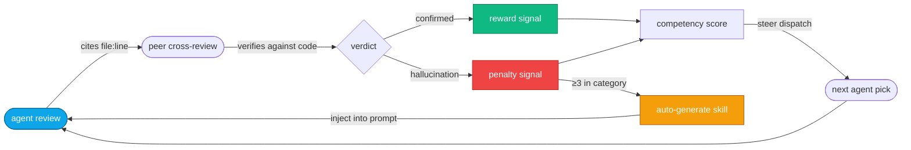

<p align="center">
  
</p>

<p align="center">
  <strong>Multi-agent consensus code review.</strong><br/>
  AI reviewers lie confidently. Gossipcat makes them check each other — against your actual code.
</p>

<p align="center">
  <code>TypeScript</code> · <code>MCP</code> · <code>Claude Code</code> · <code>Cursor</code> · <code>multi-agent</code>
</p>

<p align="center">
  <a href="https://www.npmjs.com/package/gossipcat"></a>
  <a href="https://github.com/gossipcat-ai/gossipcat-ai/actions/workflows/ci.yml"></a>
  <a href="https://github.com/gossipcat-ai/gossipcat-ai/blob/master/LICENSE"></a>
  <a href="https://github.com/gossipcat-ai/gossipcat-ai/stargazers"></a>
</p>

<p align="center">
  <a href="#quick-start">Quick start</a> ·
  <a href="#how-it-works">How it works</a> ·
  <a href="docs/GUIDE.md">Guide</a> ·
  <a href="docs/HANDBOOK.md">Handbook</a> ·
  <a href="CHANGELOG.md">Changelog</a>
</p>

---

A single AI reviewer will, with total confidence, report bugs that aren't there. You read the finding, you go look, you waste twenty minutes — the code was fine. No second opinion, no track record, no way to tell a real catch from a hallucination until you've paid for it.

Gossipcat runs **several agents in parallel**, has each one **verify its peers' findings against your real `file:line`**, and only surfaces what survives. When an agent invents a finding, a peer catches it and the agent's accuracy score drops — over time the system routes each kind of work to whoever is measurably reliable at it. The verdict comes from citation checks against your source, never from one model grading another.

It runs as an MCP server inside [Claude Code](https://claude.com/claude-code) and [Cursor](https://cursor.com), with a live operator dashboard and a two-way browser chat bridge into the running orchestrator.

<p align="center">
  
</p>

---

## Reading a report

Your whole job is four tags:

| Tag | Means | What you do |
|-----|-------|-------------|
| **CONFIRMED** | Multiple agents found it and verified it against the code | Fix it |
| **UNIQUE** | One agent found it, cross-checked and held up | Fix it — high signal |
| **DISPUTED** | Agents disagreed; gossipcat re-checked the code | Trust the verdict |
| **UNVERIFIED** | Looks real but wasn't cross-checked yet | Glance, then verify |

The DISPUTED false alarm that cross-review kills is the bug a solo reviewer would have shipped to you. That delta is the whole point.

---

## How it works


```mermaid
flowchart LR
    A([agent review]) -->|cites file:line| B([peer cross-review])
    B -->|verifies against code| C{verdict}
    C -->|confirmed| D[reward signal]
    C -->|hallucination| E[penalty signal]
    D --> F[competency score]
    E --> F
    F -->|steer dispatch| G([next agent pick])
    E -->|≥3 in category| H[auto-generate skill]
    H -->|inject into prompt| A
    G --> A
    style A fill:#0ea5e9,stroke:#0369a1,color:#fff
    style H fill:#f59e0b,stroke:#b45309,color:#fff
    style D fill:#10b981,stroke:#047857,color:#fff
    style E fill:#ef4444,stroke:#b91c1c,color:#fff
```

Every finding must cite a real `file:line`. Peers verify the citation **mechanically** — agree, disagree, or new — and the verified outcomes become reward signals that update per-agent competency scores. An agent that keeps failing in one category gets a *skill file* auto-generated from its own failure history and injected into future prompts; skills that don't measurably help are statistically demoted. It's in-context reinforcement learning at the prompt layer: the reward is grounded in your source code, the "policy update" is a markdown file, and no weights are ever touched.

Since v0.8, skills also activate **by task relevance** instead of shipping wholesale, and agents can **pull skills on demand mid-task** — including your own Claude Code project skills from `.claude/skills/`, no duplication needed.

---

## Quick start

Node 22+, and either Claude Code or Cursor.

```bash
npx skills add gossipcat-ai/gossipcat-ai   # fastest — installer skill walks you through it
```

or manually:

```bash
npm install -g gossipcat
claude mcp add gossipcat -s user -- gossipcat     # Claude Code
# Cursor: add { "gossipcat": { "command": "gossipcat" } } to .cursor/mcp.json
```

Then, in any project:

> *"Set up a gossipcat team for this project."*
> *"Do a consensus review of my recent changes."*

The smallest working team — `sonnet-reviewer` + `haiku-researcher` — is fully native and needs **zero API keys**: it runs on your existing Claude Code / Cursor subscription. Relay agents (Gemini, OpenAI, Grok, DeepSeek, Ollama, any OpenAI-compatible endpoint) are optional and mix freely.

First run, daily recipes, dashboard, configuration, and troubleshooting: **[docs/GUIDE.md](docs/GUIDE.md)**.

---

## Compared to the alternatives

| | Filters hallucinations | Improves over time |
|---|---|---|
| **Gossipcat** — 3+ agents cross-review; confirmed bugs only | **Yes** — peers catch and penalize hallucinations mechanically | **Yes** — accuracy steers dispatch; skill files fix repeat failures |
| Single-agent review (IDE built-in) | No — hallucinations ship as findings | No feedback loop |
| Model-grades-model review | Partial — the judge hallucinates too | Scores aren't wired to dispatch |
| Lint-style PR bots | No | No |

The difference is ground truth: findings are verified against actual `file:line` citations in *your* codebase, which is what makes the reward signal trustworthy enough to automate.

---

## Architecture

```
gossipcat/
  apps/cli/               MCP server, host-aware native agent bridge, boot sequence
  packages/
    orchestrator/         Dispatch pipeline, consensus engine, memory, skills, scoring
    relay/                WebSocket relay server, dashboard REST/WS API
    dashboard-v2/         React + Vite + shadcn/ui frontend (see DESIGN.md)
    client/               WebSocket client for relay connections
    tools/                File / shell / git tools for worker agents
    types/                Shared types and message protocol
```

**Native agents** run as host subagents (Claude Code `Agent()` / Cursor `Task()`) on your subscription — no API key. **Relay agents** run as WebSocket workers against any provider. Both participate equally in consensus, memory, and skill development.

> Reading this as a Claude Code or Cursor instance? Call `gossip_status()` — it boots your full operating rules. The internals and design invariants live in [docs/HANDBOOK.md](docs/HANDBOOK.md).

---

## Docs

| | |
|---|---|
| [docs/GUIDE.md](docs/GUIDE.md) | Operator guide — first run, daily recipes, dashboard, config, tools, troubleshooting |
| [docs/HANDBOOK.md](docs/HANDBOOK.md) | Internals — architectural invariants, the signal pipeline, why the design is shaped this way |
| [CHANGELOG.md](CHANGELOG.md) | Releases, with per-version upgrade steps |
| [CLAUDE.md](CLAUDE.md) | The operating rules gossipcat's own agents follow while developing gossipcat |

---

## Roadmap

Dashboard enrichment (graphs, trends, session history) · local Postgres migration · Windsurf / VS Code native parity · standalone CLI. Shipped work: [releases](https://github.com/gossipcat-ai/gossipcat-ai/releases).

## Contributing

Bug reports, ideas, and PRs welcome — [open an issue](https://github.com/gossipcat-ai/gossipcat-ai/issues) or ask in-session *"file a gossipcat bug report about …"*. Fork, branch, `npm test`, conventional commits; details in [CONTRIBUTING.md](CONTRIBUTING.md).

## License

[MIT](LICENSE)
